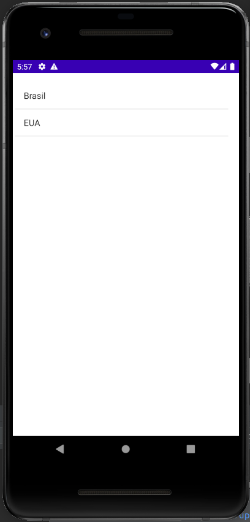

## Just simple example of code to show how to navigate around in native java

\
&nbsp;

### First screen with list

### Possible second screen with list

### Possible third screen with information

### Possible third screen with information

### Possible fourth screen with information

